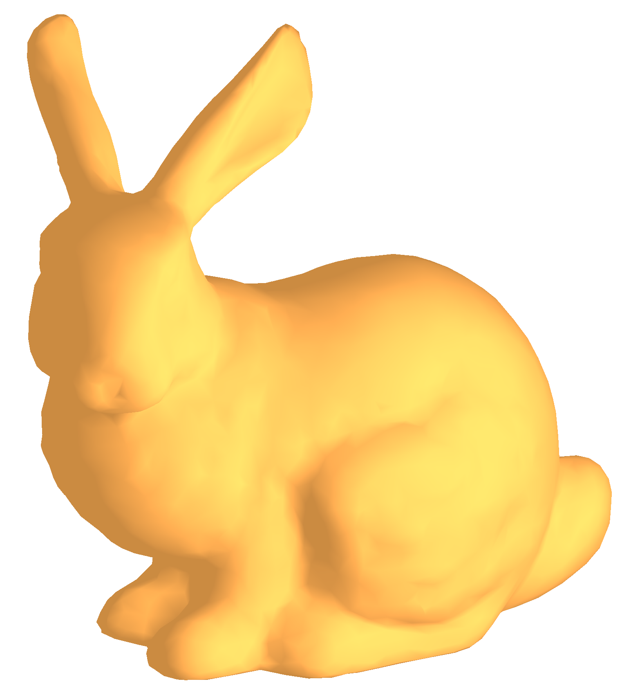

# クロスプラットフォーム3Dサンプル

## 概要

[ZOZOMAT](https://zozo.jp/zozomat/)の3D計測結果を表示するためにOpenGLおよびC ++クロスプラットフォームコードを選択した理由を説明します。

そして、サンプルコードと、クロスプラットフォーム実装のベストプラクティスについて説明します。

このサンプルは、次の記事に関連しています。

[ZOZOMATのクロスプラットフォーム3D](https://test-zozotechblog.hatenablog.com/entry/feature/20200518-zozomat_cross_platform_3d)

## ビルド要件

macOS: macOS 10.13 （High Sierra） 以降, Xcode 9.3 以降

iOS: iOS 11.0 以降, Xcode 9.0 以降

Android: Android 5.0（API レベル 21）以降, Android Studio 1.0 以降

## ランタイム要件

macOS: macOS 10.13 （High Sierra） 以降

iOS: iOS 11.0 以降

Android: Android 5.0（API レベル 21） 以降

## ライセンシング

このサンプルのライセンス情報については、`LICENSE.txt`を参照してください。

次の単一ヘッダーライブラリ`./common/HandmadeMath.h`と`./common/tinyobj_loader_c.h`が使用されます。

ライセンスについてはソースファイル自体を参照してください。
